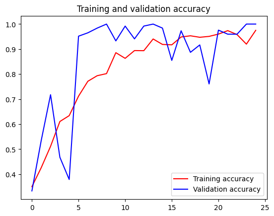

```python
import os
import zipfile

local_zip = 'D:/mldownload/rps.zip'
zip_ref = zipfile.ZipFile(local_zip, 'r')
zip_ref.extractall('D:/mldownload/')
zip_ref.close()

local_zip = 'D:/mldownload/rps-test-set.zip'
zip_ref = zipfile.ZipFile(local_zip, 'r')
zip_ref.extractall('D:/mldownload/')
zip_ref.close()

```


```python
rock_dir = os.path.join('D:/mldownload/rps/rock')
paper_dir = os.path.join('D:/mldownload/rps/paper')
scissors_dir = os.path.join('D:/mldownload/rps/scissors')

print('total training rock images:', len(os.listdir(rock_dir)))
print('total training paper images:', len(os.listdir(paper_dir)))
print('total training scissors images:', len(os.listdir(scissors_dir)))

rock_files = os.listdir(rock_dir)
print(rock_files[:10])

paper_files = os.listdir(paper_dir)
print(paper_files[:10])

scissors_files = os.listdir(scissors_dir)
print(scissors_files[:10])

```

    total training rock images: 840
    total training paper images: 840
    total training scissors images: 840
    ['rock01-000.png', 'rock01-001.png', 'rock01-002.png', 'rock01-003.png', 'rock01-004.png', 'rock01-005.png', 'rock01-006.png', 'rock01-007.png', 'rock01-008.png', 'rock01-009.png']
    ['paper01-000.png', 'paper01-001.png', 'paper01-002.png', 'paper01-003.png', 'paper01-004.png', 'paper01-005.png', 'paper01-006.png', 'paper01-007.png', 'paper01-008.png', 'paper01-009.png']
    ['scissors01-000.png', 'scissors01-001.png', 'scissors01-002.png', 'scissors01-003.png', 'scissors01-004.png', 'scissors01-005.png', 'scissors01-006.png', 'scissors01-007.png', 'scissors01-008.png', 'scissors01-009.png']
    


```python
%matplotlib inline

import matplotlib.pyplot as plt
import matplotlib.image as mpimg

pic_index = 2

next_rock = [os.path.join(rock_dir, fname) 
                for fname in rock_files[pic_index-2:pic_index]]
next_paper = [os.path.join(paper_dir, fname) 
                for fname in paper_files[pic_index-2:pic_index]]
next_scissors = [os.path.join(scissors_dir, fname) 
                for fname in scissors_files[pic_index-2:pic_index]]

for i, img_path in enumerate(next_rock+next_paper+next_scissors):
  #print(img_path)
  img = mpimg.imread(img_path)
  plt.imshow(img)
  plt.axis('Off')
  plt.show()

```


    

    


    

    


    

    


    

    


    

    


    

    


```python
import tensorflow as tf
import keras_preprocessing
from keras_preprocessing import image
from keras_preprocessing.image import ImageDataGenerator

TRAINING_DIR = "D:/mldownload/rps/"
training_datagen = ImageDataGenerator(
      rescale = 1./255,
	    rotation_range=40,
      width_shift_range=0.2,
      height_shift_range=0.2,
      shear_range=0.2,
      zoom_range=0.2,
      horizontal_flip=True,
      fill_mode='nearest')

VALIDATION_DIR = "D:/mldownload/rps-test-set/"
validation_datagen = ImageDataGenerator(rescale = 1./255)

train_generator = training_datagen.flow_from_directory(
	TRAINING_DIR,
	target_size=(150,150),
	class_mode='categorical',
  batch_size=126
)

validation_generator = validation_datagen.flow_from_directory(
	VALIDATION_DIR,
	target_size=(150,150),
	class_mode='categorical',
  batch_size=126
)

model = tf.keras.models.Sequential([
    # Note the input shape is the desired size of the image 150x150 with 3 bytes color
    # This is the first convolution
    tf.keras.layers.Conv2D(64, (3,3), activation='relu', input_shape=(150, 150, 3)),
    tf.keras.layers.MaxPooling2D(2, 2),
    # The second convolution
    tf.keras.layers.Conv2D(64, (3,3), activation='relu'),
    tf.keras.layers.MaxPooling2D(2,2),
    # The third convolution
    tf.keras.layers.Conv2D(128, (3,3), activation='relu'),
    tf.keras.layers.MaxPooling2D(2,2),
    # The fourth convolution
    tf.keras.layers.Conv2D(128, (3,3), activation='relu'),
    tf.keras.layers.MaxPooling2D(2,2),
    # Flatten the results to feed into a DNN
    tf.keras.layers.Flatten(),
    tf.keras.layers.Dropout(0.5),
    # 512 neuron hidden layer
    tf.keras.layers.Dense(512, activation='relu'),
    tf.keras.layers.Dense(3, activation='softmax')
])


model.summary()

model.compile(loss = 'categorical_crossentropy', optimizer='rmsprop', metrics=['accuracy'])

history = model.fit(train_generator, epochs=25, steps_per_epoch=20, validation_data = validation_generator, verbose = 1, validation_steps=3)

model.save("rps.h5")

```

    Found 2520 images belonging to 3 classes.
    Found 372 images belonging to 3 classes.
    Model: "sequential"
    _________________________________________________________________
    Layer (type)                 Output Shape              Param #   
    =================================================================
    conv2d (Conv2D)              (None, 148, 148, 64)      1792      
    _________________________________________________________________
    max_pooling2d (MaxPooling2D) (None, 74, 74, 64)        0         
    _________________________________________________________________
    conv2d_1 (Conv2D)            (None, 72, 72, 64)        36928     
    _________________________________________________________________
    max_pooling2d_1 (MaxPooling2 (None, 36, 36, 64)        0         
    _________________________________________________________________
    conv2d_2 (Conv2D)            (None, 34, 34, 128)       73856     
    _________________________________________________________________
    max_pooling2d_2 (MaxPooling2 (None, 17, 17, 128)       0         
    _________________________________________________________________
    conv2d_3 (Conv2D)            (None, 15, 15, 128)       147584    
    _________________________________________________________________
    max_pooling2d_3 (MaxPooling2 (None, 7, 7, 128)         0         
    _________________________________________________________________
    flatten (Flatten)            (None, 6272)              0         
    _________________________________________________________________
    dropout (Dropout)            (None, 6272)              0         
    _________________________________________________________________
    dense (Dense)                (None, 512)               3211776   
    _________________________________________________________________
    dense_1 (Dense)              (None, 3)                 1539      
    =================================================================
    Total params: 3,473,475
    Trainable params: 3,473,475
    Non-trainable params: 0
    _________________________________________________________________
    Epoch 1/25
    20/20 [==============================] - 43s 2s/step - loss: 1.4438 - accuracy: 0.3504 - val_loss: 1.1110 - val_accuracy: 0.3333
    Epoch 2/25
    20/20 [==============================] - 42s 2s/step - loss: 1.0731 - accuracy: 0.4262 - val_loss: 1.0508 - val_accuracy: 0.5349
    Epoch 3/25
    20/20 [==============================] - 44s 2s/step - loss: 1.0859 - accuracy: 0.5115 - val_loss: 0.8395 - val_accuracy: 0.7177
    Epoch 4/25
    20/20 [==============================] - 44s 2s/step - loss: 0.9377 - accuracy: 0.6107 - val_loss: 1.1738 - val_accuracy: 0.4677
    Epoch 5/25
    20/20 [==============================] - 57s 3s/step - loss: 0.8077 - accuracy: 0.6341 - val_loss: 0.8715 - val_accuracy: 0.3790
    Epoch 6/25
    20/20 [==============================] - 52s 3s/step - loss: 0.7337 - accuracy: 0.7119 - val_loss: 0.3249 - val_accuracy: 0.9516
    Epoch 7/25
    20/20 [==============================] - 52s 3s/step - loss: 0.5511 - accuracy: 0.7714 - val_loss: 0.3242 - val_accuracy: 0.9651
    Epoch 8/25
    20/20 [==============================] - 52s 3s/step - loss: 0.5400 - accuracy: 0.7937 - val_loss: 0.2097 - val_accuracy: 0.9839
    Epoch 9/25
    20/20 [==============================] - 52s 3s/step - loss: 0.5403 - accuracy: 0.8020 - val_loss: 0.1731 - val_accuracy: 1.0000
    Epoch 10/25
    20/20 [==============================] - 52s 3s/step - loss: 0.3261 - accuracy: 0.8857 - val_loss: 0.1743 - val_accuracy: 0.9328
    Epoch 11/25
    20/20 [==============================] - 51s 3s/step - loss: 0.3603 - accuracy: 0.8631 - val_loss: 0.0716 - val_accuracy: 0.9919
    Epoch 12/25
    20/20 [==============================] - 52s 3s/step - loss: 0.2842 - accuracy: 0.8940 - val_loss: 0.1678 - val_accuracy: 0.9409
    Epoch 13/25
    20/20 [==============================] - 55s 3s/step - loss: 0.3011 - accuracy: 0.8937 - val_loss: 0.0516 - val_accuracy: 0.9919
    Epoch 14/25
    20/20 [==============================] - 60s 3s/step - loss: 0.1759 - accuracy: 0.9405 - val_loss: 0.0185 - val_accuracy: 1.0000
    Epoch 15/25
    20/20 [==============================] - 60s 3s/step - loss: 0.2258 - accuracy: 0.9187 - val_loss: 0.0377 - val_accuracy: 0.9839
    Epoch 16/25
    20/20 [==============================] - 59s 3s/step - loss: 0.2065 - accuracy: 0.9171 - val_loss: 0.2871 - val_accuracy: 0.8548
    Epoch 17/25
    20/20 [==============================] - 60s 3s/step - loss: 0.1496 - accuracy: 0.9484 - val_loss: 0.0835 - val_accuracy: 0.9731
    Epoch 18/25
    20/20 [==============================] - 59s 3s/step - loss: 0.1358 - accuracy: 0.9532 - val_loss: 0.2319 - val_accuracy: 0.8871
    Epoch 19/25
    20/20 [==============================] - 59s 3s/step - loss: 0.1335 - accuracy: 0.9472 - val_loss: 0.1261 - val_accuracy: 0.9167
    Epoch 20/25
    20/20 [==============================] - 60s 3s/step - loss: 0.1359 - accuracy: 0.9508 - val_loss: 0.4183 - val_accuracy: 0.7608
    Epoch 21/25
    20/20 [==============================] - 56s 3s/step - loss: 0.1208 - accuracy: 0.9599 - val_loss: 0.0824 - val_accuracy: 0.9758
    Epoch 22/25
    20/20 [==============================] - 60s 3s/step - loss: 0.0839 - accuracy: 0.9738 - val_loss: 0.0670 - val_accuracy: 0.9597
    Epoch 23/25
    20/20 [==============================] - 61s 3s/step - loss: 0.1421 - accuracy: 0.9579 - val_loss: 0.0790 - val_accuracy: 0.9597
    Epoch 24/25
    20/20 [==============================] - 64s 3s/step - loss: 0.2082 - accuracy: 0.9198 - val_loss: 0.0361 - val_accuracy: 1.0000
    Epoch 25/25
    20/20 [==============================] - 63s 3s/step - loss: 0.0790 - accuracy: 0.9750 - val_loss: 0.0353 - val_accuracy: 1.0000
    


```python
import matplotlib.pyplot as plt
acc = history.history['accuracy']
val_acc = history.history['val_accuracy']
loss = history.history['loss']
val_loss = history.history['val_loss']

epochs = range(len(acc))

plt.plot(epochs, acc, 'r', label='Training accuracy')
plt.plot(epochs, val_acc, 'b', label='Validation accuracy')
plt.title('Training and validation accuracy')
plt.legend(loc=0)
plt.figure()
plt.show()
```


    

    


    <Figure size 640x480 with 0 Axes>


```python

```
